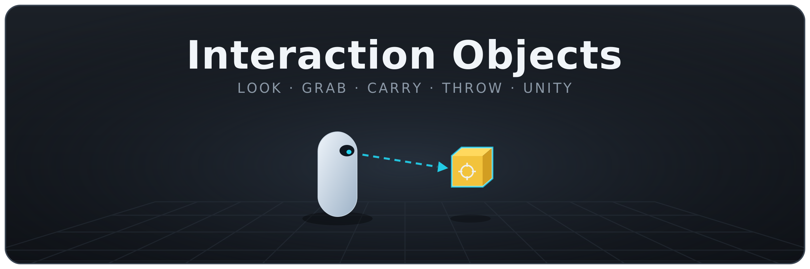
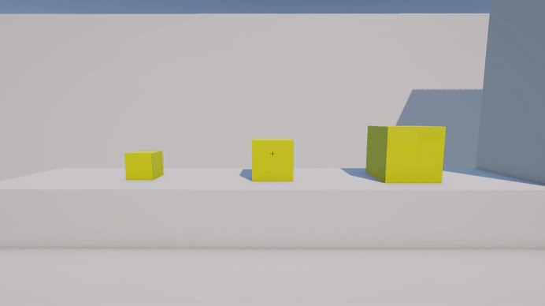
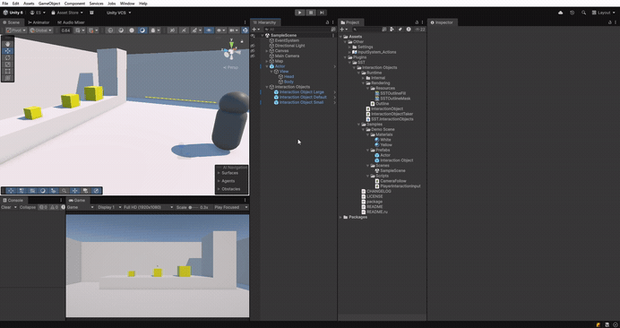

[](../../releases)
[](../../releases)
[](../../commits)
[](LICENSE.md)

**English** | [Русский](README.ru.md)

---

A drop-in first-person interaction system for Unity.

Look at a physics object to highlight it, then pick it up, carry it on a mass-aware hand joint, drop it or throw it — and it is released automatically if it slips behind a wall. Ships with an original outline effect (Built-in RP and URP) and a demo controller.

## Table Of Contents

<details>
<summary>Details</summary>

- [Installation](#installation)
- [How it works](#how-it-works)
- [Usage](#usage)
  - [Set up the taker](#set-up-the-taker)
  - [Mark interactable objects](#mark-interactable-objects)
  - [Drive it from input](#drive-it-from-input)
- [Settings](#settings)
- [Outline](#outline)
- [Auto-drop behind walls](#auto-drop-behind-walls)
- [Public API](#public-api)
- [Demo](#demo)
- [License](#license)

</details>

---

## Installation

1. **.unitypackage** — [Releases](../../releases)
2. **UPM** — `Window → Package Manager` → `+` → `Add package from git URL`:
   `https://github.com/SST-Systems/Interaction-Objects.git`
   Append `#tag` to pin a version.
3. **Manual** — clone or download, copy to `Assets/`.

Unity 2021.3+ · Built-in Render Pipeline and URP

---

## How it works

A single driver, `InteractionObjectTaker`, sits on the player's "eyes" (usually the camera or an aim pivot). On a fixed interval it casts a ray along its forward axis and reports the first `InteractionObject` it hits, highlighting that object with an outline while it stays under the crosshair.

When you interact, the taker attaches the object to a hidden kinematic `ConfigurableJoint` — the "hand" — whose springs are tuned to the object's mass, so light and heavy props both follow the camera smoothly. Interacting again releases the object; throwing launches it forward with a force scaled down by its mass.

<p align="center">
  
</p>

---

## Usage

### Set up the taker

Add `InteractionObjectTaker` to the transform that aims the ray — typically the main camera or a pivot that rotates with the view. The hand joint, the ray loop and highlighting are all handled internally.

### Mark interactable objects

Add `InteractionObject` to every prop the player may grab. It requires a `Rigidbody` and an `Outline` (both are added automatically), so the object is driven by physics and can be highlighted.

> **Tip:** enable **Interpolate** on each prop's `Rigidbody` (Inspector → Rigidbody → *Interpolate → Interpolate*). Without it the object visibly jitters between physics steps while you carry it.

### Drive it from input

Call the two public methods from your input layer (Input System, buttons, a custom controller — anything):

```csharp
using SST.InteractionObjects;

public class PlayerInteractionInput : MonoBehaviour
{
    [SerializeField] private InteractionObjectTaker _taker;

    private void Update()
    {
        // Pick up what you're looking at, or drop what you're holding.
        if (Input.GetKeyDown(KeyCode.E))
            _taker.Interaction();

        // Throw the held object.
        if (Input.GetMouseButtonDown(0))
            _taker.ThrowObject();
    }
}
```

<p align="center">
  
</p>

---

## Settings

**`InteractionObjectTaker`**

| Field | Description |
|---|---|
| `interactionDistance` | Maximum distance at which an object can be picked up. |
| `offsetStartRaycast` | Forward offset of the ray's origin from the taker's centre. |
| `armLength` | Maximum reach at which a held object floats in front of the player. |
| `throwPower` | Throw force. The object's mass reduces the effective launch speed. |
| `wallLayers` | Layers treated as walls. A held object that goes behind one is dropped. |

**`InteractionObject` (hover highlight)**

| Field | Description |
|---|---|
| `Outline Color` | Colour of the highlight shown under the crosshair. |
| `Outline Width` | Highlight thickness in screen space. |
| `Outline Mode` | When the highlight is drawn relative to scene depth. |

For deeper joint tuning (spring strength, maximum force, linear limit), edit the constants in `HandJointController`.

---

## Outline

`Outline` is a standalone highlight component with no third-party dependencies. It renders an inverted-hull silhouette: the mesh is extruded along its smoothed normals and filled with a solid colour, while a stencil mask keeps the outline from bleeding over the object itself. It uses two single-pass materials (mask + fill) so it renders correctly in both the Built-in Render Pipeline and URP, and works on `MeshRenderer` and `SkinnedMeshRenderer` alike.

| Property | Description |
|---|---|
| `OutlineMode` | `OutlineVisible` (default), `OutlineHidden` (x-ray), or `OutlineAll`. |
| `OutlineColor` | Outline colour; the alpha channel controls opacity. |
| `OutlineWidth` | Screen-space thickness, `0`–`10`. |

```csharp
var outline = gameObject.GetComponent<Outline>();
outline.OutlineColor = Color.cyan;
outline.OutlineWidth = 6f;
outline.OutlineMode = Outline.Mode.OutlineVisible;
outline.enabled = true;
```

---

## Auto-drop behind walls

While an object is held, the taker keeps a line of sight from the eyes to it. If a collider on the `Wall Layers` mask comes between the player and the object — it slips behind a wall — the object is released automatically.

Assign `Wall Layers` to the layer(s) your level geometry uses, and keep interactable props on a different layer. The check ignores the held object's own colliders, and leaving the mask empty disables the behaviour.

---

## Public API

| Member | Type | Description |
|---|---|---|
| `InteractionObjectTaker.Interaction()` | method | Picks up the hovered object, or drops it. |
| `InteractionObjectTaker.ThrowObject()` | method | Throws the held object forward. |
| `InteractionObject.SetOutline(bool)` | method | Shows or hides the hover highlight. |
| `InteractionObject.Rigidbody` | property | The object's cached `Rigidbody`. |

All runtime types live in the `SST.InteractionObjects` namespace.

---

## Demo

The `Samples` folder contains a `Demo Scene` and a `PlayerInteractionInput` controller — a primitive first-person setup (WASD movement, mouse look, pick-up and throw) that shows the pieces wired together.

---

## License

Distributed under the [MIT License](LICENSE.md). Free for personal and commercial use.

Author — **Egor Shesterikov**.
